# 모아 · JEV Workplace 기능별 화면 갤러리

JEV의 실제 의미 판단(System One Choice)과 `@json-render/react` 인터랙티브 컴포넌트로 렌더링된 각 기능별 전체 화면 캡처 모음입니다.  
모든 화면은 UI 잘림 없이 상단 헤더, 사이드바, 자연어 질문 말풍선, 컴포넌트 본문, 반응 메타데이터(JEV 왕복/판단 시간, 토큰, 비용), 입력 폼까지 전체를 포함하고 있습니다.

---

## 목차
- [00. 메인 대시보드 (홈 화면)](#00-메인-대시보드-홈-화면)
- [01. 구내식당 - 오늘 점심 메뉴](#01-구내식당---오늘-점심-메뉴)
- [02. 구내식당 - 오늘 저녁 메뉴](#02-구내식당---오늘-저녁-메뉴)
- [03. 구내식당 - 하루 전체 식단 (조·중·석식)](#03-구내식당---하루-전체-식단-조중석식)
- [04. 구내식당 - 이번 주 식단표](#04-구내식당---이번-주-식단표)
- [05. 나의 일정 - 오늘 타임라인](#05-나의-일정---오늘-타임라인)
- [06. 나의 일정 - 이번 주 전체 일정](#06-나의-일정---이번-주-전체-일정)
- [07. 날씨 - 오늘 날씨 종합 요약](#07-날씨---오늘-날씨-종합-요약)
- [08. 날씨 - 습도 단일 지표 강조](#08-날씨---습도-단일-지표-강조)
- [09. 날씨 - 이번 주 날씨 예보](#09-날씨---이번-주-날씨-예보)
- [10. 휴가 관리 - 휴가 신청 폼 (오후 반차)](#10-휴가-관리---휴가-신청-폼-오후-반차)
- [11. 휴가 관리 - 연차 잔여 일수 조회](#11-휴가-관리---연차-잔여-일수-조회)
- [12. 휴가 관리 - 신청 내역 및 취소](#12-휴가-관리---신청-내역-및-취소)
- [13. 회의실 예약 - 날짜 및 시간 선택](#13-회의실-예약---날짜-및-시간-선택)
- [14. 사내 공지 - 공지 목록 및 상세 펼치기](#14-사내-공지---공지-목록-및-상세-펼치기)
- [15. 사내 LLM 라우팅 (업무 외 질문)](#15-사내-llm-라우팅-업무-외-질문)
- [16. 복합 업무 요청 조합 (점심 + 일정)](#16-복합-업무-요청-조합-점심--일정)
- [17. 요청 처리 과정 인스펙터 패널](#17-요청-처리-과정-인스펙터-패널)

---

### 00. 메인 대시보드 (홈 화면)
- **설명**: 첫 진입 시 날짜, 인사말, 4대 업무 빠른 접근 카드, 추천 질문 및 사내 주요 공지 알림이 표시됩니다.
- **이미지**:
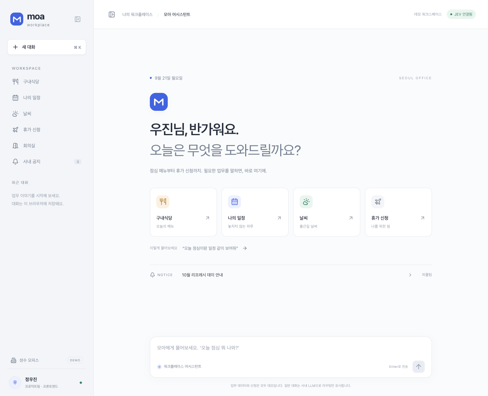

---

### 01. 구내식당 - 오늘 점심 메뉴
- **요청 문장**: `오늘 점심 뭐 나와?`
- **UI 컴포넌트**: `MealSingleCard (lunch)`
- **특징**: 점심 메뉴, 영양 정보(칼로리), 식사 종류 탭 및 날짜 이동 제공.
- **이미지**:
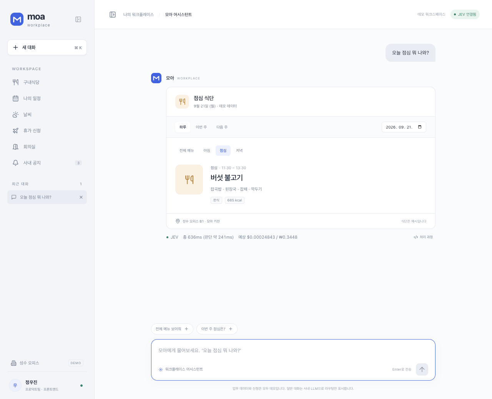

---

### 02. 구내식당 - 오늘 저녁 메뉴
- **요청 문장**: `오늘 저녁 메뉴 보여줘`
- **UI 컴포넌트**: `MealSingleCard (dinner)`
- **특징**: 저녁 전용 아이콘 및 식단 구성, 운영 시간 안내.
- **이미지**:
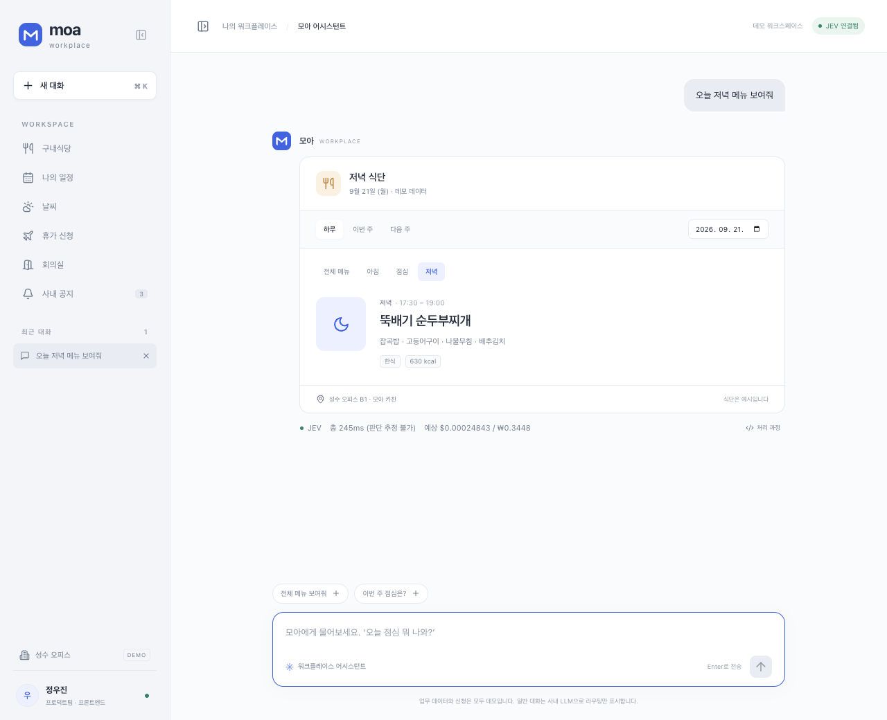

---

### 03. 구내식당 - 하루 전체 식단 (조·중·석식)
- **요청 문장**: `점심 말고 전체 메뉴 보여줘`
- **UI 컴포넌트**: `MealDayCard`
- **특징**: 아침, 점심, 저녁 세 행을 타임라인 카드로 한눈에 비교.
- **이미지**:
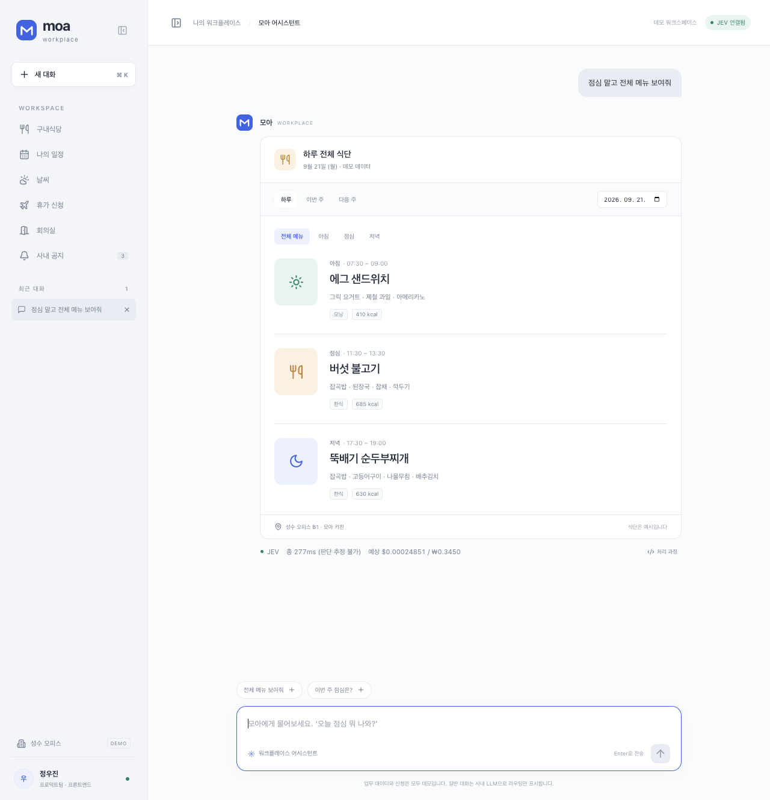

---

### 04. 구내식당 - 이번 주 식단표
- **요청 문장**: `이번 주 식단 보여줘`
- **UI 컴포넌트**: `MealWeekCard`
- **특징**: 월요일부터 일요일까지 요일별 점심/저녁 메인 메뉴 및 칼로리 목록.
- **이미지**:
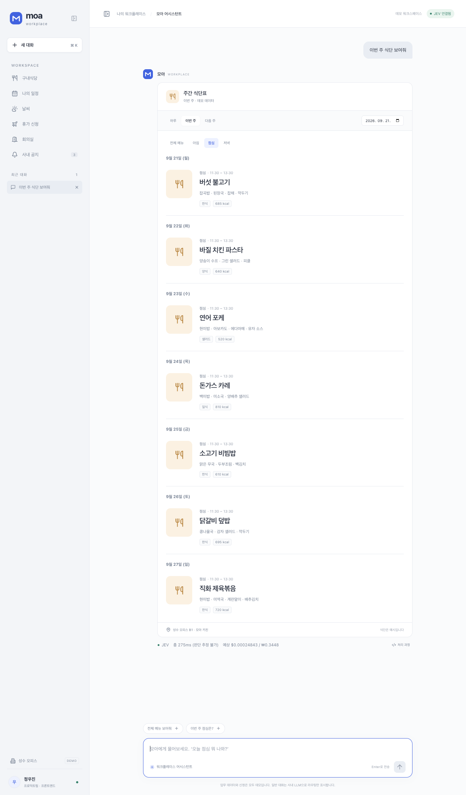

---

### 05. 나의 일정 - 오늘 타임라인
- **요청 문장**: `오늘 일정 보여줘`
- **UI 컴포넌트**: `ScheduleDayCard`
- **특징**: 오늘의 회의 및 개인 업무 타임라인, 장소와 참석자 상세 펼치기 지원.
- **이미지**:
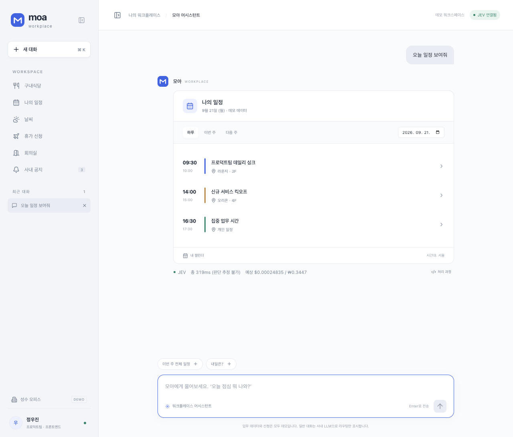

---

### 06. 나의 일정 - 이번 주 전체 일정
- **요청 문장**: `이번 주 전체 일정 보여줘`
- **UI 컴포넌트**: `ScheduleWeekCard`
- **특징**: 요일별 일정 그룹화 및 빈 일정 안내.
- **이미지**:
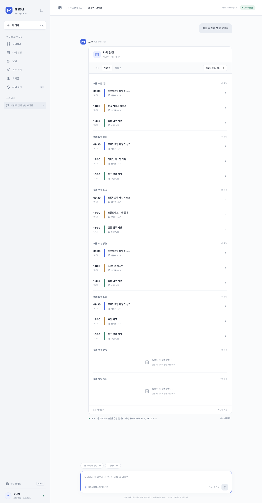

---

### 07. 날씨 - 오늘 날씨 종합 요약
- **요청 문장**: `오늘 날씨 알려줘`
- **UI 컴포넌트**: `WeatherOverviewCard`
- **특징**: 현재 기온(24°), 구름 상태, 습도·강수확률·풍속 종합 지표 및 3시간 단위 시간대별 예보.
- **이미지**:
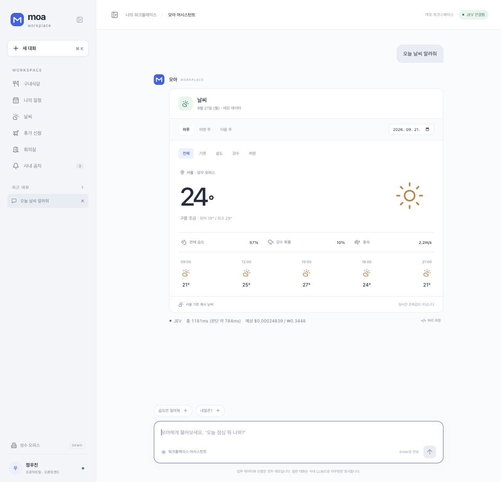

---

### 08. 날씨 - 습도 단일 지표 강조
- **요청 문장**: `오늘 습도만 알려줘`
- **UI 컴포넌트**: `WeatherMetricCard (humidity)`
- **특징**: 요청된 습도 지표를 대형 수치와 상태 텍스트로 부각.
- **이미지**:
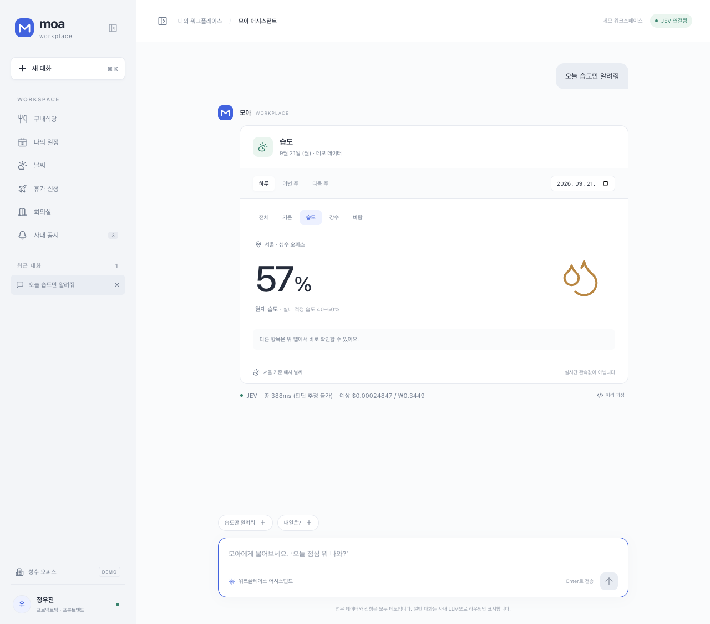

---

### 09. 날씨 - 이번 주 날씨 예보
- **요청 문장**: `이번 주 날씨 알려줘`
- **UI 컴포넌트**: `WeatherWeekCard`
- **특징**: 요일별 기상 상태 아이콘, 최저/최고 기온 바.
- **이미지**:
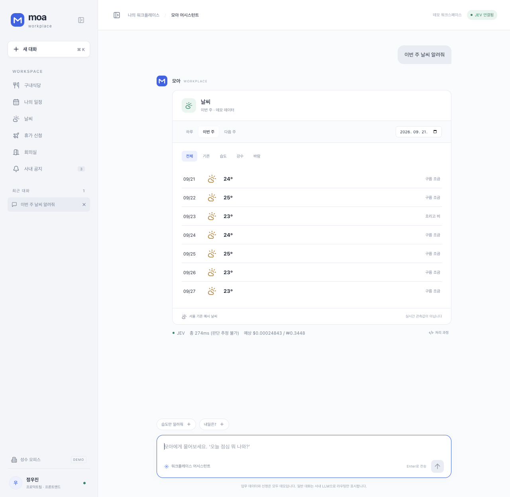

---

### 10. 휴가 관리 - 휴가 신청 폼 (오후 반차)
- **요청 문장**: `금요일 오후 반차 쓰고 싶어`
- **UI 컴포넌트**: `LeaveApplicationCard (pm)`
- **특징**: 자연어에서 추출된 날짜(2026.09.25)와 휴가 종류(오후 반차 0.5일)가 사전 바인딩된 신청 폼. 잔여 연차 및 승인자 안내.
- **이미지**:
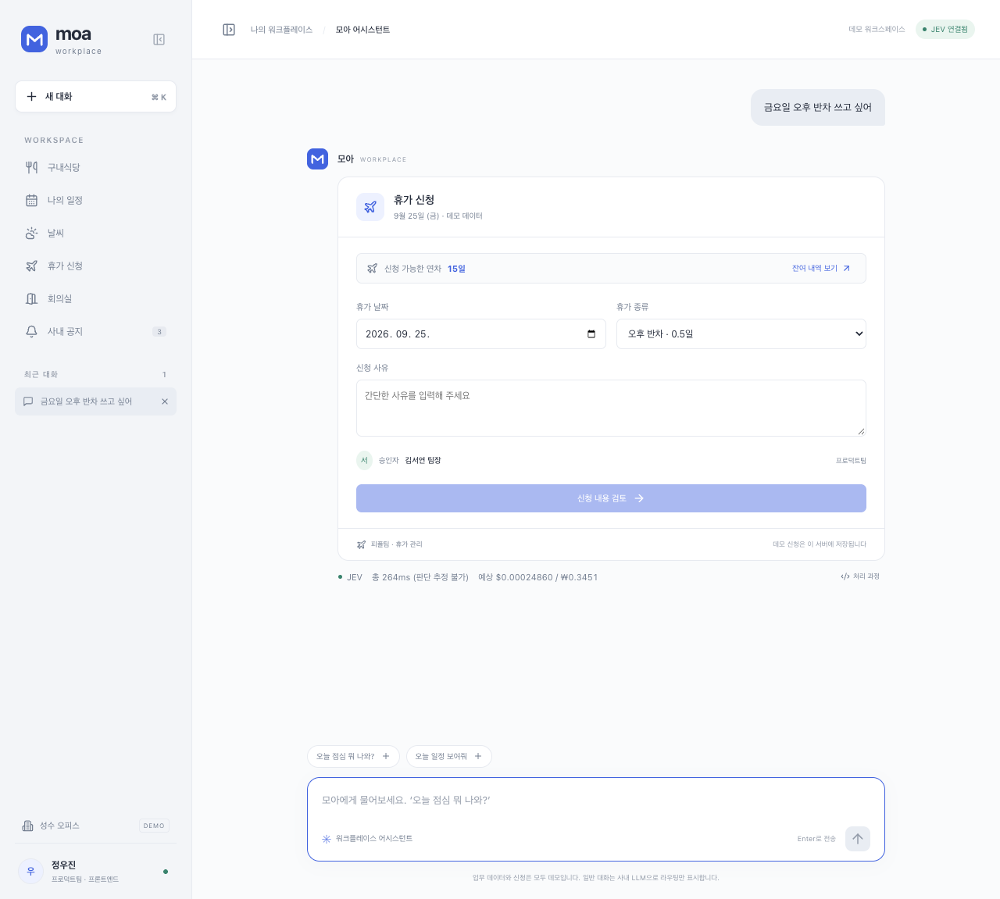

---

### 11. 휴가 관리 - 연차 잔여 일수 조회
- **요청 문장**: `내 연차 얼마나 남았어?`
- **UI 컴포넌트**: `LeaveBalanceCard`
- **특징**: 잔여 일수(15일) 대형 숫자, 프로그레스 바, 부여/사용 완료/승인 대기 통계 및 바로 신청 버튼.
- **이미지**:
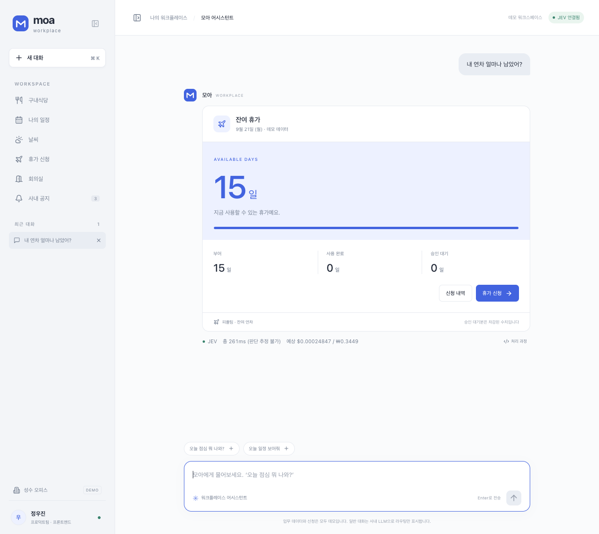

---

### 12. 휴가 관리 - 신청 내역 및 취소
- **요청 문장**: `휴가 신청 내역 보여줘`
- **UI 컴포넌트**: `LeaveHistoryCard`
- **특징**: 제출된 신청 내역, 결재 상태 태그 및 신청 취소 액션.
- **이미지**:
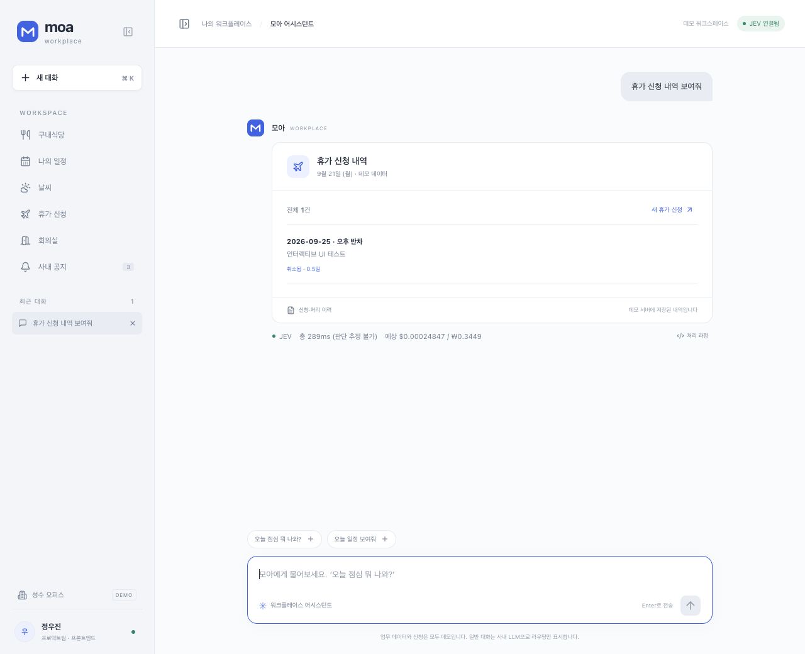

---

### 13. 회의실 예약 - 날짜 및 시간 선택
- **요청 문장**: `내일 회의실 예약하고 싶어`
- **UI 컴포넌트**: `RoomBookingCard`
- **특징**: 회의실별(오리온, 시리우스, 루나) 수용 인원/장비 안내 및 시간 슬롯 선택/예약.
- **이미지**:
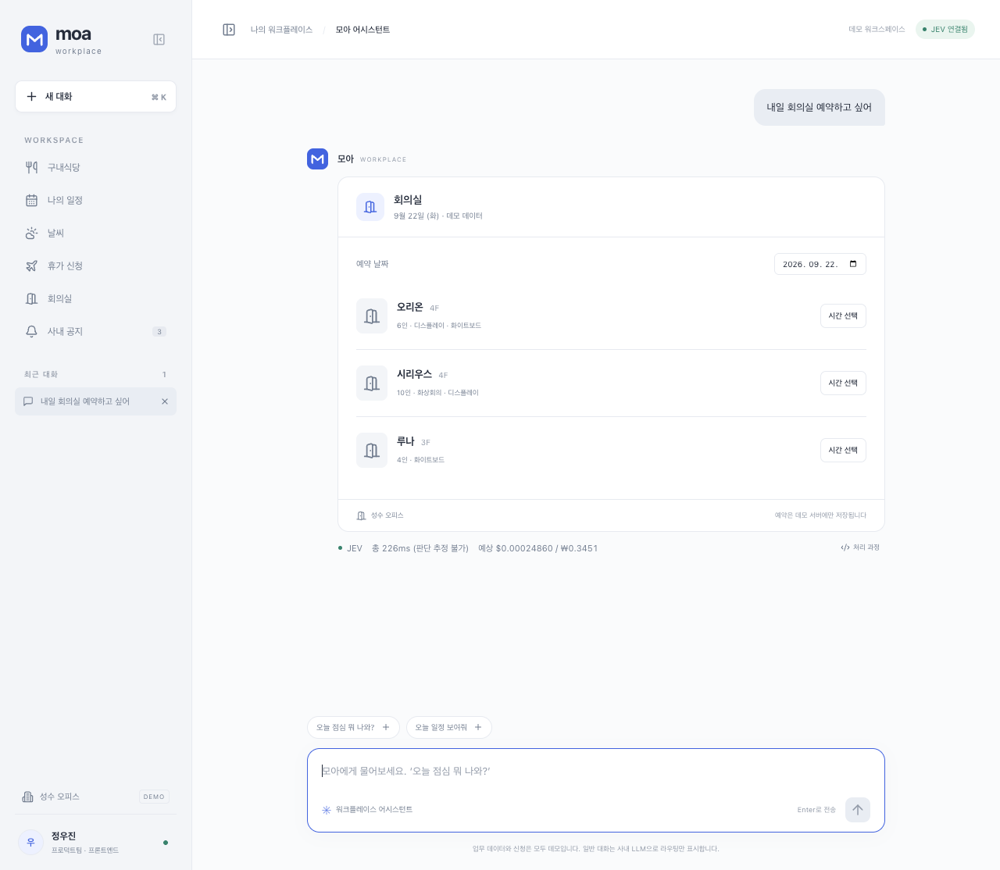

---

### 14. 사내 공지 - 공지 목록 및 상세 펼치기
- **요청 문장**: `최근 사내 공지 보여줘`
- **UI 컴포넌트**: `NoticeListCard`
- **특징**: 중요 공지 뱃지, 부서 태그, 클릭 시 펼쳐지는 본문 아코디언.
- **이미지**:
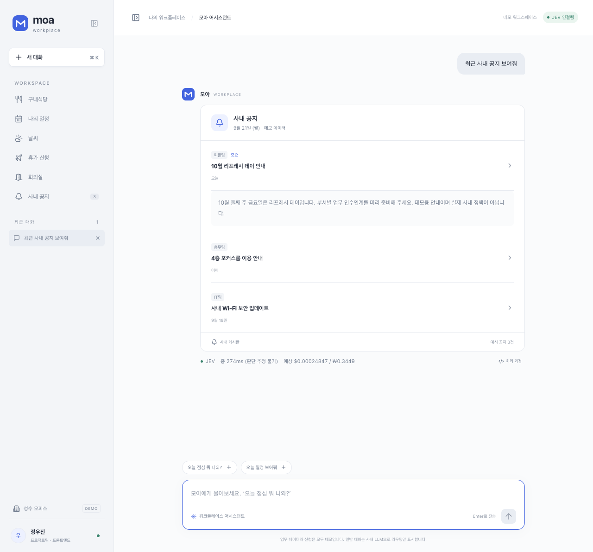

---

### 15. 사내 LLM 라우팅 (업무 외 질문)
- **요청 문장**: `파이썬으로 정렬 함수 만들어줘`
- **UI 컴포넌트**: `LLMHandoffCard`
- **특징**: 업무 포털 범위를 벗어난 일반 대화/코딩 질의는 불필요한 LLM 비용을 소모하지 않고 사내 LLM 라우팅 카드로 안전하게 분기.
- **이미지**:
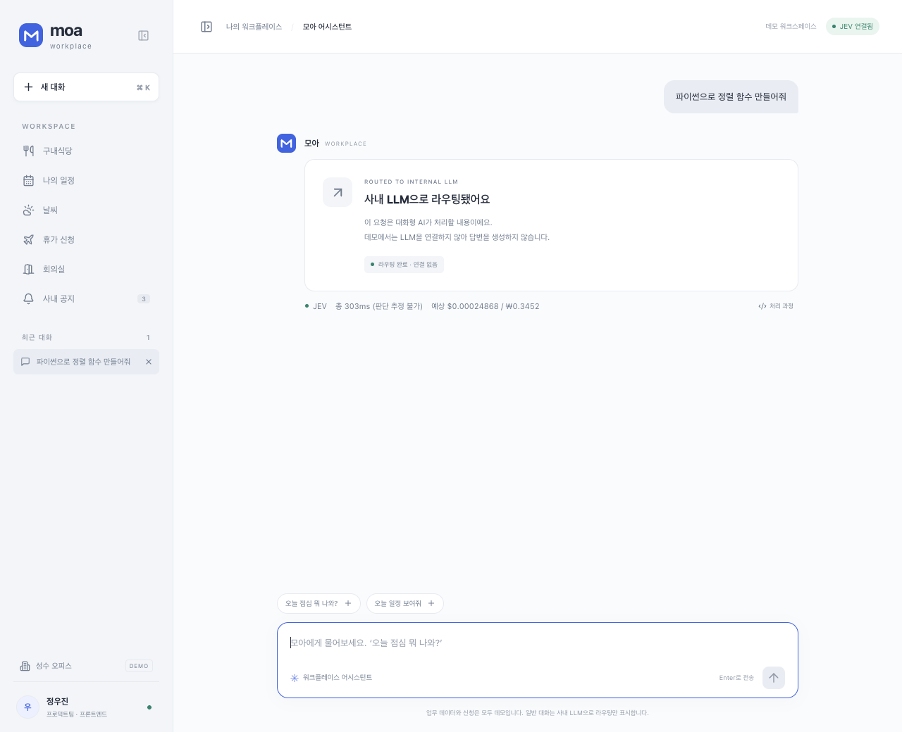

---

### 16. 복합 업무 요청 조합 (점심 + 일정)
- **요청 문장**: `오늘 점심이랑 일정 같이 보여줘`
- **UI 컴포넌트**: `PortalStack (MealSingleCard + ScheduleDayCard)`
- **특징**: 두 가지 업무를 자연어로 한 번에 요청 시 하나의 스택 안에 두 카드를 순서대로 조합하여 렌더링.
- **이미지**:
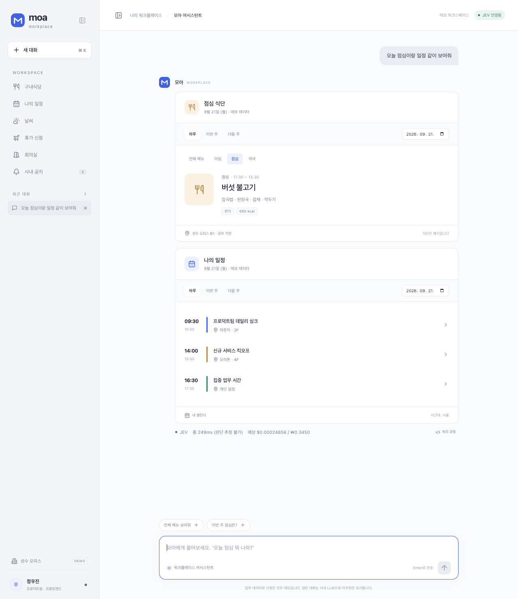

---

### 17. 요청 처리 과정 인스펙터 패널
- **동작**: 카드 하단의 `처리 과정` 버튼 클릭
- **UI 컴포넌트**: `Trace Inspector Drawer`
- **특징**: 전체 응답 시간, 모델 왕복, 추정 판단 시간, 네트워크 지연, 토큰 수, 예상 비용(USD/KRW), JEV의 의미 판단 결과 JSON, 확률 분포, json-render Spec을 슬라이드 드로어로 투명하게 제공.
- **이미지**:
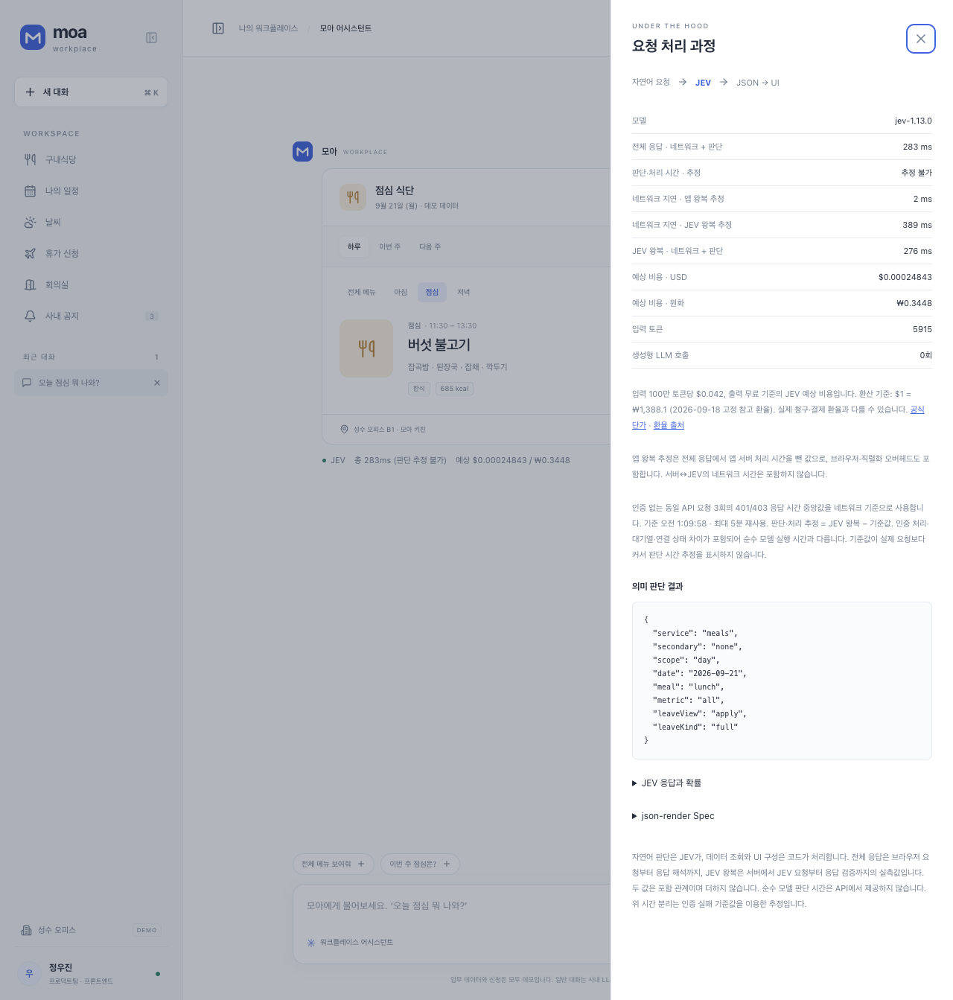
